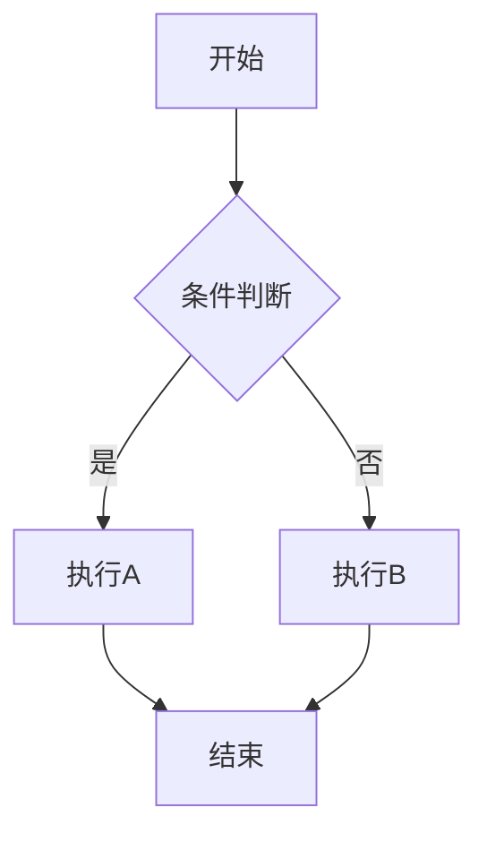

# 表格、代码块、数学公式教程

> 在笔记中使用高级内容块：表格、代码块和数学公式。

---

## 表格

### 插入表格

输入 `/表格`，选择行列数插入。

### 表格操作

| 操作 | 方法 |
|---|---|
| 调整列宽 | 拖拽列边框 |
| 调整行高 | 拖拽行边框 |
| 插入行 | 右键单元格 → 插入行 |
| 删除行 | 右键单元格 → 删除行 |
| 合并单元格 | 选中多个单元格 → 右键合并 |

### 表格快捷键

| 快捷键 | 效果 |
|---|---|
| Tab | 移到下一个单元格 |
| Shift + Tab | 移到上一个单元格 |
| Enter | 在单元格内换行 |

---

## 代码块

### 插入代码块

输入 `/代码`，选择编程语言。

### 支持的语言

JavaScript、TypeScript、Python、Java、Go、Rust、C/C++、HTML、CSS、SQL、Bash、JSON、YAML、Markdown 等几十种。

### 代码块功能

- **语法高亮**：根据语言自动高亮
- **复制代码**：点击代码块右上角的复制按钮
- **语言切换**：点击语言标签切换

---

## 数学公式

### 插入公式

输入 `/数学`，插入公式块。

### 行内公式

用 `$...` 包裹：`$E = mc^2$`

### 块级公式

用 `$$...$$` 包裹：

```latex
$$
\sum_{i=1}^{n} x_i = x_1 + x_2 + \cdots + x_n
$$
```

### 常用 LaTeX 语法

| 语法 | 效果 |
|---|---|
| `x^2` | 上标 |
| `x_i` | 下标 |
| `\frac{a}{b}` | 分数 |
| `\sqrt{x}` | 根号 |
| `\sum` | 求和 |
| `\int` | 积分 |
| `\alpha \beta \gamma` | 希腊字母 |

---

## Mermaid 图表

### 插入图表

输入 `/Mermaid`，选择图表类型。

### 流程图示例



### 支持的图表类型

- **流程图**：graph / flowchart
- **时序图**：sequenceDiagram
- **类图**：classDiagram
- **甘特图**：gantt
- **状态图**：stateDiagram

---

## 脚注

输入 `/脚注` 插入脚注引用。脚注会自动编号，在页面底部显示完整内容。

---

## 下一步

- [Mermaid 流程图教程](./mermaid.md) — 更多 Mermaid 示例
- [Markdown 编辑器教程](./editor-markdown.md) — Markdown 模式
- [斜杠命令速查](./slash-commands.md) — 所有命令

---

> 本教程基于 nowen-note v1.1.18 编写。
