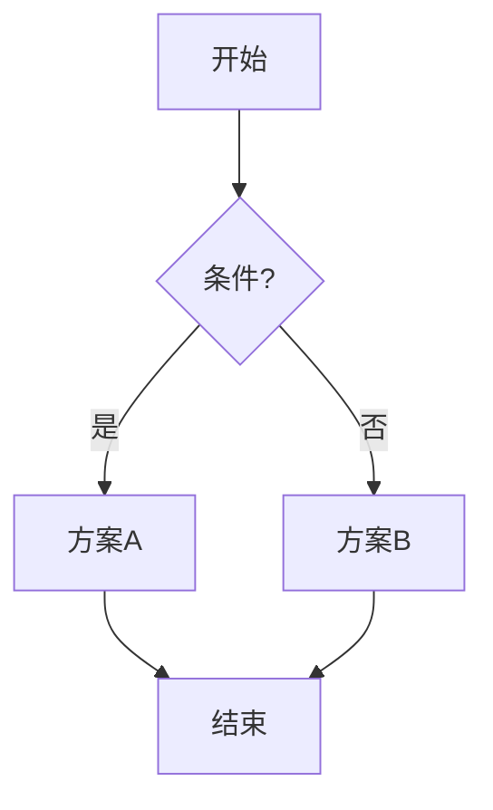
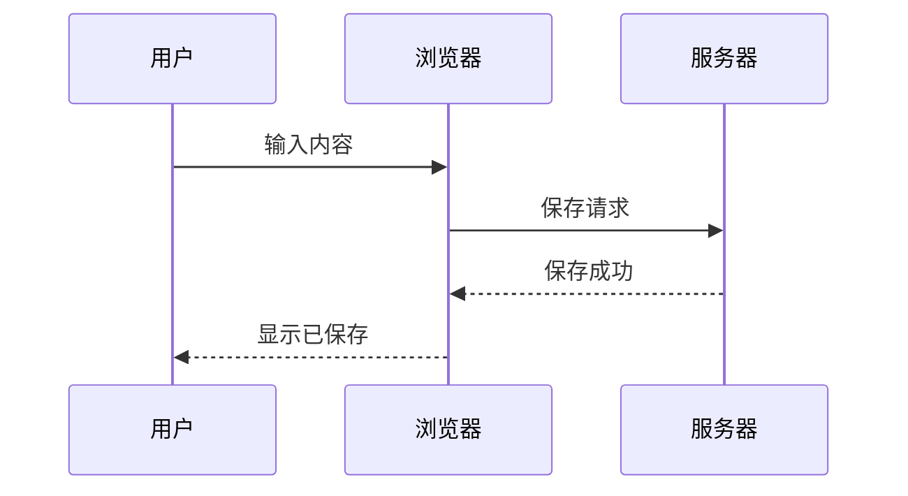
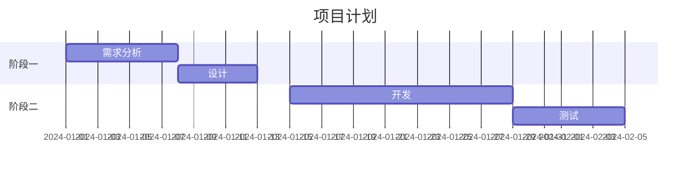
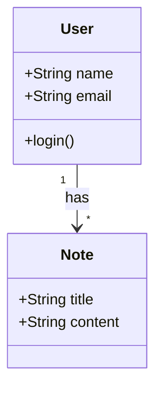
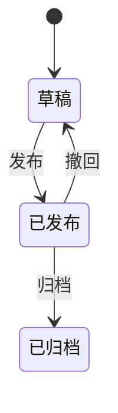

# Mermaid 流程图教程

> 用 Mermaid 语法在笔记中画流程图、时序图、甘特图。

---

## 什么是 Mermaid？

Mermaid 是一种用文本语法画图表的工具。在 nowen-note 中，你只需输入文本就能生成各种图表。

---

## 插入 Mermaid 图表

在编辑器中输入 `/Mermaid`，选择图表类型，然后输入内容。

---

## 流程图



**语法：**

```
graph TD
    A[节点文字] --> B{判断}
    B -->|条件1| C[结果1]
    B -->|条件2| D[结果2]
```

- `TD` = 从上到下（Top Down）
- `LR` = 从左到右（Left Right）
- `[]` = 矩形节点
- `{}` = 菱形判断节点
- `()` = 圆形节点

---

## 时序图



**语法：**

```
sequenceDiagram
    participant A
    participant B
    A->>B: 消息
    B-->>A: 回复
```

---

## 甘特图



---

## 类图



---

## 状态图



---

## 常见问题

### Q：Mermaid 图表不显示？

确认语法正确。可以在 [Mermaid Live Editor](https://mermaid.live/) 中测试。

### Q：图表太小看不清？

在全屏模式下查看，或点击图表放大。

---

## 下一步

- [思维导图入门](./mindmap-intro.md) — 节点式思维导图
- [表格、代码块、数学公式](./advanced-blocks.md) — 其他高级内容块

---

> 本教程基于 nowen-note v1.1.18 编写。
